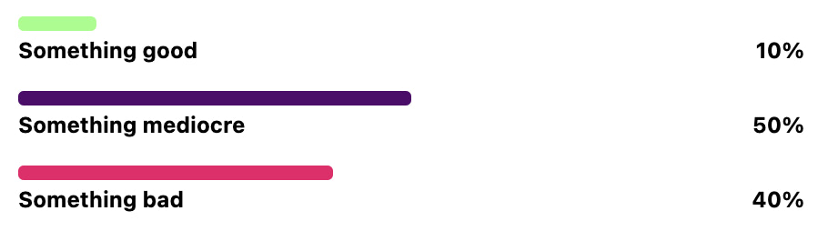

# React mini charts

A collection of tiny chart components for React projects. Written with TypeScript and CSS modules.

You can see an interactive preview of all components in the [public Storybook instance](https://main--63ef4f8b97935401942de85b.chromatic.com/). Use the "Controls" and "JSX" tabs in Storybook to customize the charts and get the code to paste into your project.

## Usage

### BarChart



```tsx
import { BarChart } from 'react-mini-charts'

<BarChart
	items={[
		{
			barWidth: '10%',
			barColor: '#adfc92',
			labelLeft: 'Something good',
			labelRight: '10%',
		},
		{
			barWidth: '50%',
			barColor: '#4a0d67',
			labelLeft: 'Something mediocre',
			labelRight: '50%',
		},
		{
			barWidth: '40%',
			barColor: '#db3069',
			labelLeft: 'Something bad',
			labelRight: '40%',
		},
	]}
/>
```

### PieChart (SVG)


```tsx
import { PieChart } from 'react-mini-charts'

<PieChart
	size={240}
	items={[
		{ percentage: 0.37, color: '#4a0d67' },
		{ percentage: 0.21, color: '#db3069' },
		{ percentage: 0.13, color: '#adfc92' },
	]}
/>
```


### Customization

- General styles like `font-family` are inherited from the surrounding CSS context.
- Specific chart styles can be overridden with `className` props.
- By default, charts have transition styles that allow for smooth transitions between values. The timing and behavior can be overridden with custom CSS classes.


## Development

1. Install dependencies with `npm install`
2. Start editing and preview your changes in Storybook with `npm run storybook`

### Building & publishing

1. Build the project to generate the output in `/dist` via `npm run build`
2. Bump the version in `package.json`
3. Re-run `npm install` to update the version in `package-lock.json`
4. Update the `CHANGELOG.md`
5. Publish to npm via `npm publish` (you might need to log in first)

### Other commands

```shell
# Format all files according to Prettier config:
npm run format

# Run all tests:
npm test
```

## Contributions & feedback

This is a spare-time project by one person, but feel free to leave comments and suggestions as [issues on GitHub](https://github.com/herrherrmann/react-mini-charts/issues)!

## Improvement ideas

- [ ] Document requirements (e.g. minimum React version)
- [ ] Document difference between HTML-based and SVG-based charts
- [ ] Calculate the percentages based on absolute values (instead of percentages to be pre-calculated on the outside)
